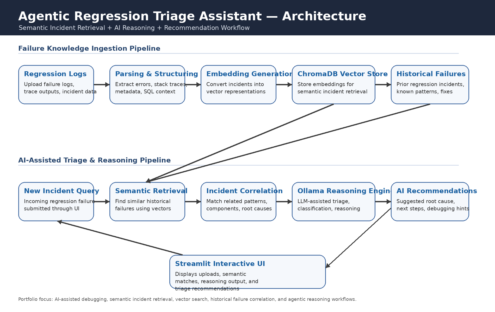

# Agentic Regression Triage Assistant

AI-assisted regression triage platform with semantic retrieval, vector similarity search, and Ollama-powered reasoning workflows.

## Architecture Diagram

## Problem

Regression debugging and failure triage often require engineers to manually analyze logs, compare historical failures, search incident databases, and correlate repeated issues across large validation environments. This process is time-consuming and difficult to scale.

## Solution

This project builds an AI-assisted regression triage workflow that ingests historical regression failures, generates embeddings, performs semantic retrieval, and uses local LLM reasoning to recommend likely root causes and similar historical incidents.

## Architecture

Logs → Parsing → Embeddings → Vector Store → Semantic Retrieval → AI Reasoning → Triage Recommendation

## Key Features

- Regression log ingestion
- Semantic similarity search
- Historical incident retrieval
- Vector embedding generation
- AI-assisted reasoning workflows
- Local LLM integration using Ollama
- Streamlit-based interactive interface

## Tech Stack

- Python
- Streamlit
- ChromaDB
- Sentence Transformers
- Ollama
- Vector Similarity Search
- Local LLM Workflows

## Portfolio Relevance

This project demonstrates practical AI systems engineering skills:

- AI-assisted debugging workflows
- Semantic incident retrieval
- Vector database implementation
- Agentic reasoning concepts
- Regression triage automation
- AI infrastructure engineering